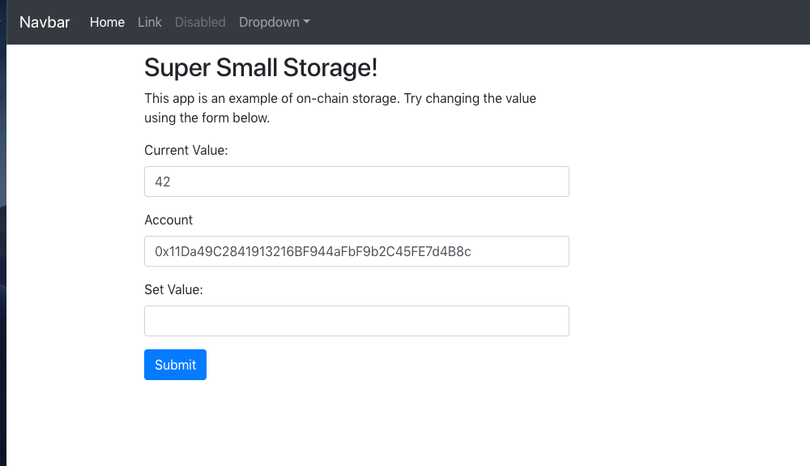

# Solidity On-Chain Storage with React and Bootstrap Client Interface
This is a simple demo of an Ethereum contract which stores a value on-chain and enables users to get and set the value. A React and Bootstrap web based interface to interact with the contract is provided. Here is a screenshot:

## Project Structure Overview
### Solidity Contract
If you're unfamiliar with the layout and components of an Ethereum Smart Contract project see this [tutorial](https://truffleframework.com/tutorials/pet-shop) for a great introduction. The main contract of interest here is `./contracts/SimpleStorage.sol`.

### Web Interface
The React and Bootstrap based web client is in the `./client` folder.

## To Run
1. Install/setup npm
2. Install/setup the [Truffle Framework](https://truffleframework.com/)
3. Install/setup [Metamask](https://metamask.io/)
4. If you plan to test the contract locally, install/setup [Ganache](https://truffleframework.com/ganache). Otherwise, edit *truffle-config.js* with the details of the network you plan to use.
5. Compile and migrate the contract to your test net
  1. Run `truffle compile`
  2. Run `truffle migrate`
6. Start the web client
  1. Change directories to the client folder
  2. Install dependencies by running `npm install`
  3. Build and run the client by running `npm run start`